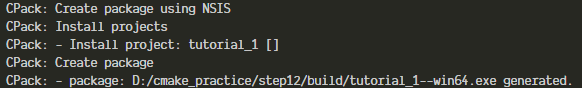

同时打包debug和release
默认情况下，CMake的模型是，构建目录只包含单个配置，无论是Debug、Release、MinSizeRel还是RelWithDebInfo。但是，可以设置CPack来捆绑多个构建目录，并构建包含同一项目的多个配置的包。
`
cd debug
cmake -DCMAKE_BUILD_TYPE=Debug ..
cmake --build .
cd ../release
cmake -DCMAKE_BUILD_TYPE=Release ..
cmake --build .
`
生成不同配置的build然后配置MultiCPackConfig.cmake打包
